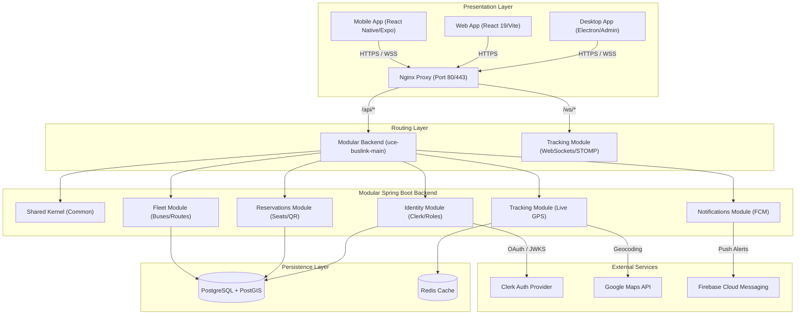

# UCE-BusLink

[](https://github.com/UCE-BusLink/UCE-BusLink)
[](https://openjdk.org/)
[](https://spring.io/projects/spring-boot)
[](https://react.dev/)
[](https://expo.dev/)
[](https://www.docker.com/)

**Smart Night Transportation System for the University — Universidad Central del Ecuador**

UCE-BusLink solves the critical problems of university night transportation: it eliminates waiting without any information and replaces the "first come, first served" seating model with a modern system of seat reservations, real-time GPS tracking and automated notifications, guaranteeing a safe, predictable and efficient service for the whole university community.

---

## Tech Stack

| Layer | Technologies |
|---|---|
| **Backend** | Spring Boot 3.5.0 · Java 21 · Multi-module Maven · JPA/Hibernate |
| **Web Frontend** | React 19 · TypeScript · Vite · Tailwind CSS |
| **Desktop Frontend (Admin)** | Electron · React 19 · TypeScript · Vite · Tailwind CSS |
| **Mobile Frontend (Passengers/Drivers)** | React Native · Expo SDK 52 · NativeWind (Tailwind CSS) |
| **Database** | PostgreSQL 15 + PostGIS (spatial extensions) |
| **Cache & Messaging** | Redis 7.2 |
| **Authentication & SSO** | Clerk Auth |
| **Infrastructure & Containers** | Docker · Docker Compose · Nginx (reverse proxy) |
| **CI/CD** | GitHub Actions · Docker Hub |
| **Deployment** | AWS EC2 |

For a deeper breakdown of what each technology is used for and where it lives in the code, see `scratch/TECNOLOGIAS.md` (internal notes, Spanish).

---

## System Architecture

The project follows a modular, decoupled structure to allow independent development of each component and ensure scalability:



---

## Repository Structure

```
UCE-BusLink/
├── .github/
│   └── workflows/
│       ├── ci.yml                       # General status checks on PRs to qa and main
│       ├── deploy.yml                   # Build, push and automatic deploy to AWS
│       ├── backend-ci.yml               # Continuous integration for the backend
│       ├── web-ci.yml                   # Continuous integration for the web app
│       ├── desktop-ci.yml               # Continuous integration for the desktop app
│       ├── mobile-ci.yml                # Continuous integration for the mobile app
│       └── pr-validation.yml            # File integrity validation
│
├── docker/
│   ├── Dockerfile.backend               # Multi-stage build with a non-root user
│   ├── Dockerfile.frontend              # Web frontend image served with Nginx
│   ├── Dockerfile.storybook             # Image for the component catalog
│   ├── nginx.conf                       # API and WebSocket routing configuration
│   ├── docker-compose.yml               # Base containers: db, redis, app
│   ├── docker-compose.local.yml         # Local development configuration
│   ├── docker-compose.qa.yml            # QA environment configuration
│   └── docker-compose.prod.yml          # Production-optimized configuration
│
├── uce-buslink-backend/                 # Multi-module Spring Boot project
│   ├── uce-buslink-shared-kernel/       # Common kernel: DTOs, exceptions and shared domain
│   ├── uce-buslink-identity-module/     # Registration, authentication and Clerk sync
│   ├── uce-buslink-fleet-module/        # Bus, stop, driver and route management
│   ├── uce-buslink-reservations-module/ # Ticket management, reservations and QR verification
│   ├── uce-buslink-tracking-module/     # STOMP WebSocket for live GPS tracking
│   ├── uce-buslink-notifications-module/ # Firebase integration for push notifications
│   └── uce-buslink-main/                # Main configuration, security and Flyway migrations
│
├── uce-buslink-frontend/                # Frontend subprojects
│   ├── uce-buslink-web/                 # Web app for students (React 19 + Vite)
│   ├── uce-buslink-desktop/             # Desktop admin panel (Electron)
│   └── uce-buslink-mobile/              # Mobile app for students and drivers (Expo)
│
├── .env.example                         # Global environment variables template
├── .dockerignore
└── .gitignore
```

---

## Environment Requirements

* Docker Desktop v24.0 or higher
* Git
* Node.js v20+ (only for local development without Docker)
* JDK 21 (only for local backend development without Docker)

---

## Quick Start Guide

### Option A: Run the Full Environment with Docker
This option brings up the database, Redis, the backend, and the Web/Storybook apps automatically:

1. **Clone the repository:**
   ```bash
   git clone https://github.com/UCE-BusLink/UCE-BusLink.git
   cd UCE-BusLink
   ```

2. **Set up environment variables:**
   Copy the `.env.example` template and fill in the required values:
   ```bash
   cp .env.example .env
   ```

3. **Bring up all containers:**
   ```bash
   docker compose -f docker/docker-compose.yml -f docker/docker-compose.local.yml up -d
   ```

4. **Check the health of the services:**
   ```bash
   docker ps --format "table {{.Names}}\t{{.Status}}"
   ```

* The web app is available at `http://localhost:3000`
* The backend API is available at `http://localhost:8080`
* The Storybook catalog is available at `http://localhost:6006`

---

### Option B: Individual Local Development per Component
If you want to run and debug services directly in your local environment, see each project's own README for details on running it standalone:

* [`uce-buslink-backend/README.md`](uce-buslink-backend/README.md)
* [`uce-buslink-frontend/uce-buslink-web/README.md`](uce-buslink-frontend/uce-buslink-web/README.md)
* [`uce-buslink-frontend/uce-buslink-desktop/README.md`](uce-buslink-frontend/uce-buslink-desktop/README.md)
* [`uce-buslink-frontend/uce-buslink-mobile/README.md`](uce-buslink-frontend/uce-buslink-mobile/README.md)

At minimum, Postgres and Redis need to be reachable, either via Docker:

```bash
docker compose -f docker/docker-compose.yml up -d db redis
```

or by pointing the backend's `.env`/profile at your own instances.

---

## Environment Variables (.env)

Copy `.env.example` to `.env` at the repository root and fill in the required values:

### Backend Server
| Variable | Description | Default |
|---|---|---|
| `APP_NAME` | Spring application name | `uce-buslink-backend` |
| `SERVER_PORT` | Backend listening port | `8080` |
| `DB_URL` | PostgreSQL JDBC connection URL | `jdbc:postgresql://db:5432/uce_buslink` |
| `DB_USERNAME` | Database user | `postgres` |
| `DB_PASSWORD` | Postgres user password | `postgres` |
| `JPA_SHOW_SQL` | Log generated SQL statements | `false` |
| `HIBERNATE_DDL_AUTO`| Schema-vs-entity validation mode | `validate` |
| `REDIS_HOST` | Redis cache connection host | `redis` |
| `REDIS_PORT` | Redis connection port | `6379` |
| `REDIS_PASSWORD` | Redis auth password | (empty) |
| `FLYWAY_ENABLED` | Run migrations automatically | `true` |
| `JWT_SECRET` | Secret key for signing JWTs | (64-character key) |
| `JWT_EXPIRATION_MS` | JWT token duration in ms | `900000` |
| `GOOGLE_CLIENT_ID` | Google client ID for authentication | - |
| `GOOGLE_MAPS_API_KEY`| Google Maps API key for tracking | - |
| `MICROSOFT_TENANT_ID`| Microsoft Azure AD tenant ID | - |
| `CLERK_SECRET_KEY` | Clerk provider secret key | - |
| `FIREBASE_CREDENTIALS`| Firebase FCM credentials JSON string | - |

### Database Container
| Variable | Description | Default |
|---|---|---|
| `POSTGRES_USER` | PostgreSQL admin user | `postgres` |
| `POSTGRES_PASSWORD` | Admin password | `postgres` |
| `POSTGRES_DB` | Initial database name | `uce_buslink` |

### Frontend & Docker Environment
| Variable | Description | Default |
|---|---|---|
| `VITE_API_URL` | Proxy target URL for the API | `/api` |
| `VITE_GOOGLE_CLIENT_ID`| Google client ID for the web app | - |
| `VITE_MICROSOFT_CLIENT_ID`| Azure client ID for the web app | - |
| `VITE_MICROSOFT_TENANT_ID`| Azure tenant ID for the web app | - |
| `VITE_CLERK_PUBLISHABLE_KEY`| Clerk public key for the web frontend | - |
| `BACKEND_TAG` | Docker image tag to build/deploy | `latest` |
| `FRONTEND_TAG` | Web frontend Docker image tag | `latest` |
| `SPRING_PROFILES_ACTIVE`| Active Spring Boot profile | `dev` |

`.env` is listed in `.gitignore` and must never be committed.

---

## Branching and Deployment Flow

We follow a strict simplified GitFlow methodology to ensure stability in production:

```
feature/* ──► dev (Integration) ──► qa (Testing) ──► main (Production)
```

| Branch | Purpose | Deployment |
|---|---|---|
| `feature/*` | New features and bug fixes | Local |
| `dev` | Continuous integration for the dev team | Local |
| `qa` | Quality assurance and user testing environment | AWS EC2 — automatic on merge |
| `main` | Stable production branch | AWS EC2 — manual team approval |

### Mandatory requirements to approve Pull Requests (to QA or Main):
1. **Backend:** Successful build and passing unit tests (`mvn clean verify`).
2. **Frontend:** No syntax errors, passing linters and a successful build (`npm run build`).

---

## CI/CD Automation (Pipeline)

* **Push to `feature/*`:** Triggers the specific workflow for the modified component to validate that it builds correctly and passes linters in isolation.
* **Pull Request to `qa` or `main`:** Runs the full integrated test suites, preventing errors before merging.
* **Merge to `qa`:** Builds and publishes images to Docker Hub tagged `:qa` and automatically deploys to the QA AWS EC2 instance.
* **Merge to `main`:** Builds production images, publishes them to Docker Hub (`:latest`, `:prod`, and the semantic version `:1.1.0`), creates the corresponding Git tag, creates a GitHub Release, and requests manual approval to update the production AWS instance.

---

## Versioning Policy

The project uses coordinated formal semantic versioning:
* **Patch (small improvements/bugfixes):** Increment the last digit (e.g. `1.1.0` -> `1.1.1`).
* **Minor (complete new features):** Increment the middle digit (e.g. `1.1.0` -> `1.2.0`).
* **Major (breaking changes or global deliveries):** Increment the first digit (e.g. `1.1.0` -> `2.0.0`).

---

## Project Authors

| Name | Role | GitHub |
|---|---|---|
| **Lenin David Alomoto Cevallos** | Backend Engineer | [@DavidAlomoto](https://github.com/ldalomoto) |
| **Rodney Jhosue Andrade Chamorro** | DevOps & Cloud Architect | [@rodneyandrade](https://github.com/RodneyAndrade3) |
| **Kennet Steveen Rodriguez Lopez** | Frontend Engineer | [@KennetRodriguez](https://github.com/Kennetrl) |
| **Melany Vanessa Vela Loachamin** | Scrum Master | [@MelanyVela](https://github.com/Vanessa-Vela) |

---

Universidad Central del Ecuador — Web Programming
