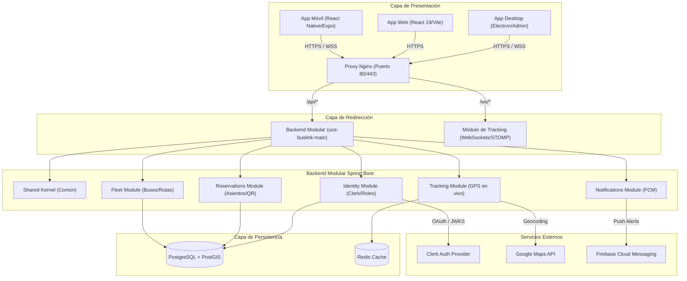

# UCE-BusLink

[](https://github.com/UCE-BusLink/UCE-BusLink)
[](https://openjdk.org/)
[](https://spring.io/projects/spring-boot)
[](https://react.dev/)
[](https://expo.dev/)
[](https://www.docker.com/)

**Sistema Inteligente de Transporte Universitario Nocturno — Universidad Central del Ecuador**

UCE-BusLink resuelve los problemas críticos del transporte nocturno universitario: elimina la espera sin información y reemplaza el modelo "el primero que llega, se sienta" con un sistema moderno de reservas de asientos, seguimiento GPS en tiempo real y notificaciones automatizadas que garantizan un servicio seguro, predecible y eficiente para toda la comunidad universitaria.

---

## Stack Tecnológico

| Capa | Tecnologías Utilizadas |
|---|---|
| **Backend** | Spring Boot 3.5.0 · Java 21 · Maven Multi-módulo · JPA/Hibernate |
| **Frontend Web** | React 19 · TypeScript · Vite · Tailwind CSS |
| **Frontend Desktop (Admin)** | Electron · React 19 · TypeScript · Vite · Tailwind CSS |
| **Frontend Mobile (Pasajeros/Conductores)** | React Native · Expo SDK 52 · NativeWind (Tailwind CSS) |
| **Base de Datos** | PostgreSQL 15 + PostGIS (Extensiones espaciales) |
| **Caché y Mensajería** | Redis 7.2 |
| **Autenticación y SSO** | Clerk Auth |
| **Infraestructura y Contenedores** | Docker · Docker Compose · Nginx (Proxy Reverso) |
| **CI/CD** | GitHub Actions · Docker Hub |
| **Despliegue** | AWS EC2 |

---

## Arquitectura del Sistema

El proyecto sigue una estructura modular y desacoplada para facilitar el desarrollo independiente de sus componentes y asegurar la escalabilidad:



---

## Estructura del Repositorio

```
UCE-BusLink/
├── .github/
│   └── workflows/
│       ├── ci.yml                       # Status checks generales en PRs a qa y main
│       ├── deploy.yml                   # Build, push y deploy automático a AWS
│       ├── backend-ci.yml               # Integración continua para el backend
│       ├── web-ci.yml                   # Integración continua para la web
│       ├── desktop-ci.yml               # Integración continua para la app de escritorio
│       ├── mobile-ci.yml                # Integración continua para la app móvil
│       └── pr-validation.yml            # Validación de integridad de archivos
│
├── docker/
│   ├── Dockerfile.backend               # Build multi-etapa con usuario no-root
│   ├── Dockerfile.frontend              # Imagen frontend web servida con Nginx
│   ├── Dockerfile.storybook             # Imagen para catálogo de componentes
│   ├── nginx.conf                       # Configuración de rutas API y WebSockets
│   ├── docker-compose.yml               # Contenedores base: db, redis, app
│   ├── docker-compose.local.yml         # Configuración para desarrollo local
│   ├── docker-compose.qa.yml            # Configuración para ambiente de pruebas
│   └── docker-compose.prod.yml          # Configuración optimizada para producción
│
├── uce-buslink-backend/                 # Proyecto Spring Boot multimodular
│   ├── uce-buslink-shared-kernel/       # Kernel común: DTOs, excepciones y dominio compartido
│   ├── uce-buslink-identity-module/     # Registro, autenticación y sincronización con Clerk
│   ├── uce-buslink-fleet-module/        # Control de buses, paradas, choferes y rutas
│   ├── uce-buslink-reservations-module/ # Gestión de boletos, reservas y verificación QR
│   ├── uce-buslink-tracking-module/     # WebSocket STOMP para seguimiento GPS en vivo
│   ├── uce-buslink-notifications-module/ # Integración con Firebase para notificaciones push
│   └── uce-buslink-main/                # Configuración principal, seguridad y migraciones Flyway
│
├── uce-buslink-frontend/                # Subproyectos de Frontend
│   ├── uce-buslink-web/                 # App Web para estudiantes (React 19 + Vite)
│   ├── uce-buslink-desktop/             # Panel administrativo de escritorio (Electron)
│   └── uce-buslink-mobile/              # App móvil para estudiantes y conductores (Expo)
│
├── .env.example                         # Plantilla de variables de entorno globales
├── .dockerignore
└── .gitignore
```

---

## Prerrequisitos de Entorno

* Docker Desktop v24.0 o superior
* Git
* Node.js v20+ (Solo para desarrollo local sin Docker)
* JDK 21 (Solo para desarrollo de backend local sin Docker)

---

## Guía de Inicio Rápido

### Opción A: Levantar Entorno Completo con Docker
Esta opción levanta la base de datos, Redis, el Backend, y las aplicaciones Web/Storybook automáticamente:

1. **Clonar el repositorio:**
   ```bash
   git clone https://github.com/UCE-BusLink/UCE-BusLink.git
   cd UCE-BusLink
   ```

2. **Configurar variables de entorno:**
   Copia el archivo de plantilla `.env.example` y rellena las claves necesarias:
   ```bash
   cp .env.example .env
   ```

3. **Levantar todos los contenedores:**
   ```bash
   docker compose -f docker/docker-compose.yml -f docker/docker-compose.local.yml up -d
   ```

4. **Verificar estado de salud de los servicios:**
   ```bash
   docker ps --format "table {{.Names}}\t{{.Status}}"
   ```

* La aplicación Web estará disponible en `http://localhost:3000`
* La API del Backend estará disponible en `http://localhost:8080`
* El catálogo Storybook estará disponible en `http://localhost:6006`

---

### Opción B: Desarrollo Local Individual por Componentes
Si deseas ejecutar y depurar los servicios directamente en tu entorno local:

#### 1. Base de Datos y Caché (Requeridos en Docker)
```bash
docker compose -f docker/docker-compose.yml up -d db redis
```

#### 2. Backend (Spring Boot)
```bash
cd uce-buslink-backend
# Ejecutar migraciones Flyway y levantar aplicación
./mvnw spring-boot:run -pl uce-buslink-main
```

#### 3. Aplicación Web
```bash
cd uce-buslink-frontend/uce-buslink-web
npm install
npm run dev
```

#### 4. Aplicación de Escritorio (Admin / Electron)
```bash
cd uce-buslink-frontend/uce-buslink-desktop
npm install
npm run dev
```

#### 5. Aplicación Móvil (Pasajeros/Conductores)
```bash
cd uce-buslink-frontend/uce-buslink-mobile
npm install
npx expo start
```

---

## Variables de Entorno (.env)

Copia `.env.example` a `.env` en la raíz del proyecto y completa los valores requeridos:

### Servidor Backend
| Variable | Descripción | Valor por Defecto |
|---|---|---|
| `APP_NAME` | Nombre de la aplicación Spring | `uce-buslink-backend` |
| `SERVER_PORT` | Puerto de escucha del backend | `8080` |
| `DB_URL` | URL JDBC de conexión a PostgreSQL | `jdbc:postgresql://db:5432/uce_buslink` |
| `DB_USERNAME` | Usuario de la base de datos | `postgres` |
| `DB_PASSWORD` | Contraseña del usuario Postgres | `postgres` |
| `JPA_SHOW_SQL` | Loggear sentencias SQL generadas | `false` |
| `HIBERNATE_DDL_AUTO`| Validación de esquema vs entidades | `validate` |
| `REDIS_HOST` | Host para conexión a Redis cache | `redis` |
| `REDIS_PORT` | Puerto para conexión a Redis | `6379` |
| `REDIS_PASSWORD` | Contraseña de autenticación Redis | (Vacío) |
| `FLYWAY_ENABLED` | Ejecutar migraciones automáticamente | `true` |
| `JWT_SECRET` | Llave secreta para firmar tokens JWT | (Llave de 64 caracteres) |
| `JWT_EXPIRATION_MS` | Duración del token JWT en ms | `900000` |
| `GOOGLE_CLIENT_ID` | Client ID de Google para autenticación | - |
| `GOOGLE_MAPS_API_KEY`| API Key de Google Maps para tracking | - |
| `MICROSOFT_TENANT_ID`| Tenant ID de Microsoft Azure AD | - |
| `CLERK_SECRET_KEY` | Clave secreta del proveedor Clerk | - |
| `FIREBASE_CREDENTIALS`| JSON string de credenciales de Firebase FCM | - |

### Contenedor de Base de Datos
| Variable | Descripción | Valor por Defecto |
|---|---|---|
| `POSTGRES_USER` | Usuario administrador de PostgreSQL | `postgres` |
| `POSTGRES_PASSWORD` | Contraseña del administrador | `postgres` |
| `POSTGRES_DB` | Nombre de la base de datos inicial | `uce_buslink` |

### Frontend y Entorno Docker
| Variable | Descripción | Valor por Defecto |
|---|---|---|
| `VITE_API_URL` | URL destino del proxy para la API | `/api` |
| `VITE_GOOGLE_CLIENT_ID`| Client ID de Google para la app web | - |
| `VITE_MICROSOFT_CLIENT_ID`| Client ID de Azure para la app web | - |
| `VITE_MICROSOFT_TENANT_ID`| Tenant ID de Azure para la app web | - |
| `VITE_CLERK_PUBLISHABLE_KEY`| Clave pública de Clerk para frontend web | - |
| `BACKEND_TAG` | Tag de imagen Docker a compilar/desplegar | `latest` |
| `FRONTEND_TAG` | Tag de imagen Docker frontend web | `latest` |
| `SPRING_PROFILES_ACTIVE`| Perfil activo de Spring Boot | `dev` |

> [!WARNING]
> Nunca incluyas el archivo `.env` en commits ni lo subas a repositorios públicos. Este archivo está explitamente ignorado por `.gitignore`.

---

## Flujo de Ramas y Despliegue

Seguimos una metodología estricta de ramificación basada en GitFlow simplificado para asegurar la estabilidad en producción:

```
feature/* ──► dev (Integración) ──► qa (Pruebas) ──► main (Producción)
```

| Rama | Propósito | Despliegue |
|---|---|---|
| `feature/*` | Nuevas características y corrección de errores | Local |
| `dev` | Integración continua del equipo de desarrollo | Local |
| `qa` | Ambiente de control de calidad y pruebas de usuario | AWS EC2 — Automático al hacer merge |
| `main` | Rama de producción estable | AWS EC2 — Aprobación manual del equipo |

### Requisitos obligatorios para aprobar Pull Requests (a QA o Main):
1. **Backend:** Compilación exitosa y pruebas unitarias aprobadas (`mvn clean verify`).
2. **Frontend:** Sin errores de sintaxis, linters aprobados y empaquetado exitoso (`npm run build`).

---

## Automatización de CI/CD (Pipeline)

* **Push a `feature/*`:** Dispara los flujos específicos del componente modificado para validar que compila correctamente y pasa los linters de manera aislada.
* **Pull Request a `qa` o `main`:** Corre todas las suites de pruebas integradas previniendo errores antes del merge.
* **Merge a `qa`:** Genera y publica las imágenes en Docker Hub con tags `:qa` y despliega automáticamente en la instancia AWS EC2 de QA.
* **Merge a `main`:** Construye las imágenes productivas, las publica en Docker Hub (`:latest`, `:prod`, y la versión semántica `:1.1.0`), genera el Tag de Git correspondiente, crea una GitHub Release y solicita aprobación manual para actualizar la instancia productiva de AWS.

---

## Política de Versionamiento

El proyecto utiliza versionado semántico formal coordinado:
* **Patch (Pequeñas mejoras/Bugfixes):** Incrementar el último dígito (ej. `1.1.0` -> `1.1.1`).
* **Minor (Nuevas funcionalidades completas):** Incrementar el dígito central (ej. `1.1.0` -> `1.2.0`).
* **Major (Cambios disruptivos o entregas globales):** Incrementar el primer dígito (ej. `1.1.0` -> `2.0.0`).

---

## Autores del Proyecto

| Nombre | Rol | GitHub |
|---|---|---|
| **Lenin David Alomoto Cevallos** | Backend Engineer | [@DavidAlomoto](https://github.com/ldalomoto) |
| **Rodney Jhosue Andrade Chamorro** | DevOps & Cloud Architect | [@rodneyandrade](https://github.com/RodneyAndrade3) |
| **Kennet Steveen Rodriguez Lopez** | Frontend Engineer | [@KennetRodriguez](https://github.com/Kennetrl) |
| **Melany Vanessa Vela Loachamin** | Scrum Master | [@MelanyVela](https://github.com/Vanessa-Vela) |

---

Universidad Central del Ecuador — Carrera de Computación — Programación Web
